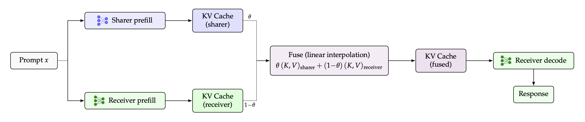

# CacheFuse

**Training-free cross-model KV-cache reuse.** A larger *sender* prefills a prompt; a smaller *receiver* answers from that cache, or from a per-layer blend `(1−θ)·receiver + θ·sender`.

The two models must share KV geometry (kv-heads, head dimension, and depth). CacheFuse scores option-letter accuracy. It does not train an adapter.

[](LICENSE)



## Quick start

```bash
git clone https://github.com/rishiskhare/CacheFuse.git
cd CacheFuse
uv sync

uv run cachefuse
```

That evaluates Qwen3-8B → Qwen3-4B on the ARC-Challenge test split, on `cuda:0`, with θ from 0.1 to 0.9. `uv run python -m cachefuse.evaluate` takes the same flags.

Add `--num-examples 50` for a short trial before the full split.

## What it scores

| Treatment | Meaning |
| --- | --- |
| `receiver` | Receiver answers from its own cache (`θ = 0`) |
| `theta` | Blend `(1−θ)·receiver + θ·sender` at each layer |
| `replace` | Receiver answers from the sender cache only (`θ = 1`) |
| `sharer` | Sender answers alone |
| `t2t` | Text-to-text baseline (optional; `--score-t2t`) |

Benchmarks: `arc_challenge`, `openbookqa`, `mmlu_redux`, `mmlu_pro`.

## Examples

**Save the results**

```bash
uv run cachefuse --out results/arc_challenge.json
```

**Resume after an interrupt.** Rerun the same command. Finished questions are skipped and failures are retried.

```bash
uv run cachefuse \
  --out results/arc_challenge.json \
  --checkpoint results/arc_challenge.jsonl
```

**First N examples of a split**

```bash
uv run cachefuse \
  --benchmark openbookqa --split train --num-examples 1000 \
  --out results/obqa_train1k.json
```

**Put the sender on a second GPU**

```bash
uv run cachefuse --device cuda:0 --sender-device cuda:1
```

**Score the text-to-text baseline.** Each question generates a hint, so this is slower.

```bash
uv run cachefuse --score-t2t
```

## Requirements

- Python ≥ 3.12
- A GPU with enough memory for both models, or `--sender-device` to split them
- A pair with the same `num_key_value_heads`, `head_dim`, and `num_hidden_layers`
- [`uv`](https://docs.astral.sh/uv/), or any environment that installs from `pyproject.toml`
- Optional: `HF_TOKEN` for gated models; `TRUST_REMOTE_CODE=1` for a custom architecture. Downloads use the Hugging Face cache (`HF_HOME`, default `~/.cache/huggingface`).

## CLI

| Flag | Default | Notes |
| --- | --- | --- |
| `--sender` / `--receiver` | `Qwen/Qwen3-8B` / `Qwen/Qwen3-4B` | Hugging Face model ids |
| `--device` | `cuda:0` | Receiver GPU |
| `--sender-device` | unset | Second GPU for the sender |
| `--benchmark` | `arc_challenge` | See the list above |
| `--split` | `test` | `train`, `validation`, or `test` |
| `--num-examples` | all | First *N* rows of the split |
| `--theta` | `0.1,…,0.9` | Comma-separated values in `[0, 1]` |
| `--score-t2t` | off | Also score the text-to-text baseline |
| `--t2t-max-new-tokens` | `256` | Cap on the sharer's hint |
| `--seed` | `42` | `transformers.set_seed` |
| `--on-error` | `skip` | `skip` or `fail` |
| `--checkpoint` | unset | JSONL path for resume |
| `--out` | unset | Results JSON path |

```bash
uv run cachefuse --help
```

## Development

```bash
uv sync --group dev
uv run pytest
uv run ruff check .
uv run mypy src
```

## License

Apache-2.0. See [LICENSE](LICENSE).
